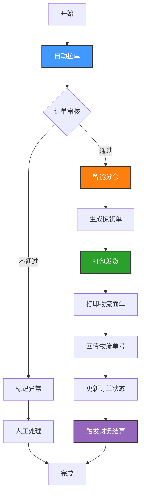
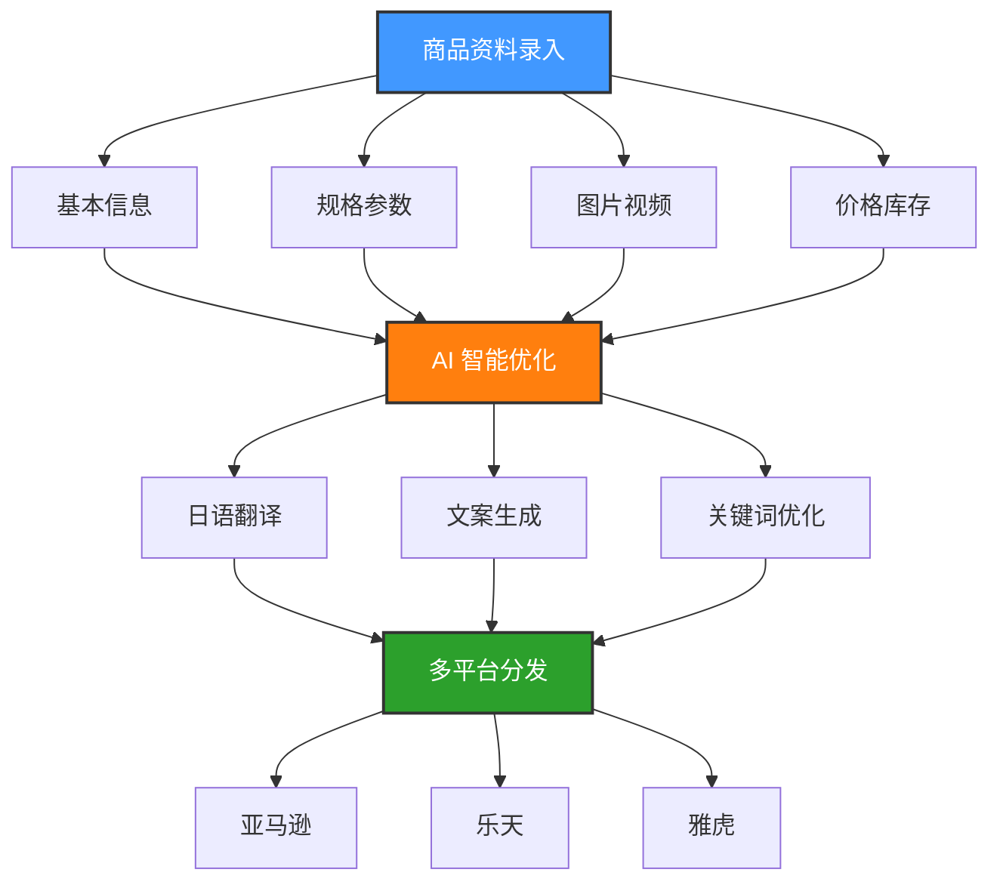
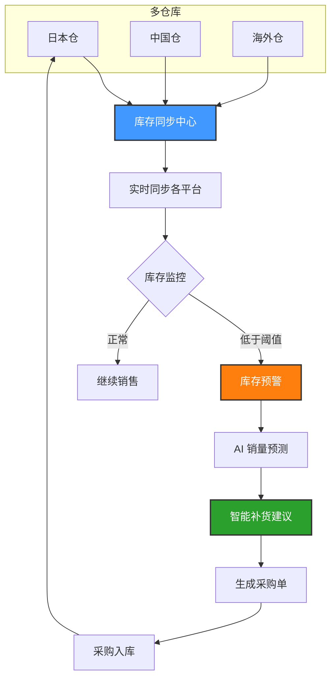
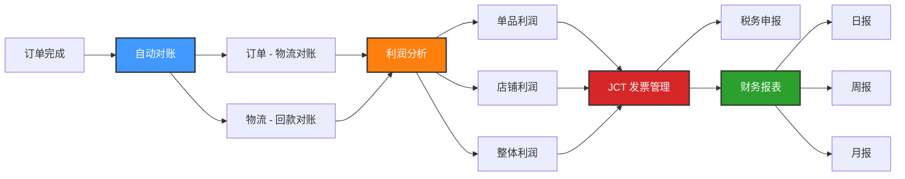
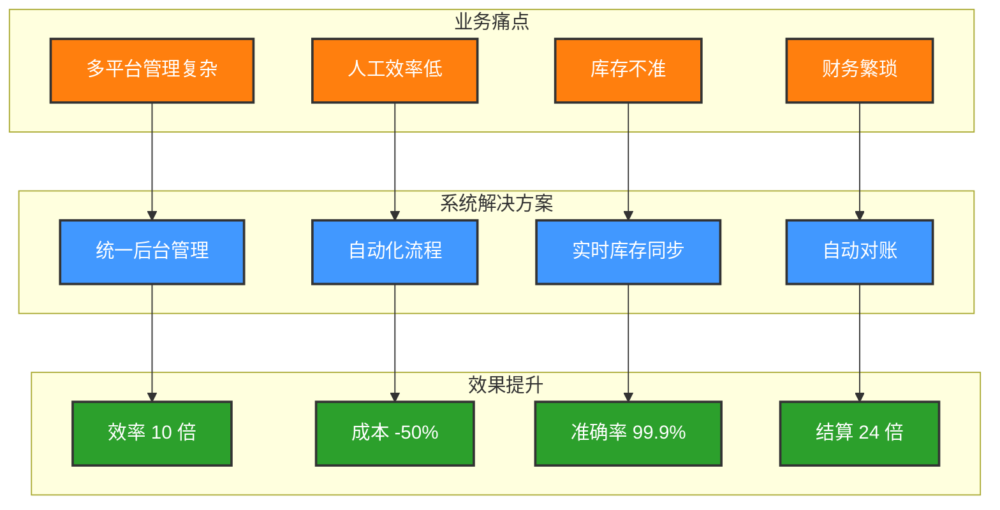
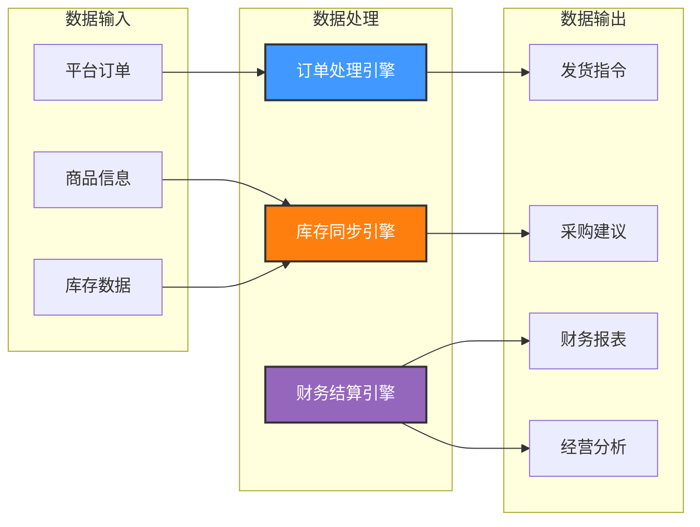

# 日本跨境电商 ERP 系统 - 核心流程图（Mermaid 可视化版）

## 一、系统整体架构图

```mermaid
graph TB
    subgraph 外部平台
        A1[亚马逊日本站]
        A2[乐天市场]
        A3[雅虎购物]
        A4[其他平台]
    end
    
    subgraph API 网关层
        B1[API 网关]
        B2[数据转换]
        B3[安全认证]
    end
    
    subgraph 核心业务层
        C1[店铺管理]
        C2[商品中心]
        C3[订单中心]
        C4[库存管理]
        C5[采购管理]
        C6[物流管理]
        C7[财务管理]
        C8[客服管理]
        C9[BI 分析]
    end
    
    subgraph 数据层
        D1[(订单数据库)]
        D2[(商品数据库)]
        D3[(库存数据库)]
        D4[(财务数据库)]
        D5[(用户数据库)]
    end
    
    外部平台 --> API 网关层
    API 网关层 --> 核心业务层
    核心业务层 --> 数据层
```

---

## 二、端到端核心业务流程


---

## 三、订单处理详细流程（核心）



---

## 四、商品管理流程



---

## 五、库存管理流程



---

## 六、财务管理流程



---

## 七、业务与系统功能对应图



---

## 八、数据流向图



---

## 文档信息

- **版本**：1.0
- **制作**：二狗子 🐕
- **日期**：2026 年 3 月 7 日
- **用途**：合作伙伴演示 - 可视化流程图
- **说明**：可使用 Mermaid 编辑器或支持 Mermaid 的平台（如 GitHub、Notion）查看渲染效果
